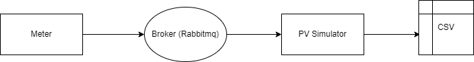

<div id="top"></div>

<!-- PROJECT LOGO -->
<br />
<div align="center">
  <a href="https://github.com/othneildrew/Best-README-Template">
    
  </a>

  <h3 align="center">PV Simulator Challenge</h3>

  <p align="center">
    The Goal of this project to creat a PV (photovoltaic) simulator which can communicate with meter throw broker (Rabbitmq). And store the values in CSV file.
  </p>
</div>


<!-- TABLE OF CONTENTS -->
<details>
  <summary>Table of Contents</summary>
  <ol>
    <li>
      <a href="#about-the-project">About The Project</a>
      <ul>
        <li><a href="#built-with">Built With</a></li>
      </ul>
    </li>
    <li>
      <a href="#getting-started">Getting Started</a>
      <ul>
        <li><a href="#prerequisites">Prerequisites</a></li>
        <li><a href="#installation">Installation</a></li>
      </ul>
    </li>
    <li><a href="#usage">Usage</a></li>
    <li><a href="#roadmap">Roadmap</a></li>
    <li><a href="#approaches">Approaches</a></li>

  </ol>
</details>


<!-- ABOUT THE PROJECT -->
## About The Project

This project has three importent parts Meter, Broker and PV simulator. The meter will reading a power value. Then, it sends the power value to the PV simulator. The PV simulator will receive the power value and also generate its on power value. At the end store the vaule in CSV.

<div align="center">

</div>

* Meter : This produse a massage to the broker with random power value 0 to 9000 Watts.

* Broker (Rabbitmq): <a href="https://www.rabbitmq.com/">RabbitMQ</a> is lightweight and easy to deploy on premises and in the cloud. It supports multiple messaging protocols.

* PV simulator: It must listen to the broker for the meter values, generate a simulated PV power value and the last step is to add this value to the meter value and output the result.


<p align="right">(<a href="#top">back to top</a>)</p>


### Built With

The project is devloped in python:3.9. Some other packege are aslo needed for the projects. 

* [Rabbitmq](https://www.rabbitmq.com/)
* [Erlang](https://www.erlang.org/)

<p align="right">(<a href="#top">back to top</a>)</p>


<!-- GETTING STARTED -->
## Getting Started

To run this project first need to clone the github repository in local directory usind gitclone command. Then need to install required package in the machine.

### Prerequisites

* In command prompt us this for installing python.
  ```sh
  pip install python
  ```
* Install pika 
  ```sh
  pip install pika
  ```
* Install python-dotenv 
  ```sh
  pip install python-dotenv
  ```
### Run 

* Open the command prompt or terminal in the program derectory.
```sh
  cd programme directory
  ```
* Run the follwing command in the terminal. 
```sh
  python App/main.py
  ``` 
* To stop the programme. 
```sh
  Ctrl + C
  ``` 

<p align="right">(<a href="#top">back to top</a>)</p>

<!-- USAGE EXAMPLES -->
## Output

The progarmme will delever two set of file. One is the log.log file which represent the track of the program running. If it has any error or not. It aslo shows the succesfull exicution with level and timestamp.

The 2nd file is the CSV file. The result is saved in a file with at least a timestamp, meter power value, PV power value and the sum of the powers (meter + PV).


<p align="right">(<a href="#top">back to top</a>)</p>


<!-- approaches -->
## Approaches
It was a good challenge for me. I had working experience on Python. But it was first experince for me to work on Rabbitmq and PV simulator. I learn a lot and I love to learn about this.

Some approaches I take to finish this project.
1. First,I learn about Rabbitmq.
2. Then, impliment a simple massage passing script.
3. Create separate script for Meter, PV simulator, and Support methods.
4. Create 4 different test case using Unittest.
5. Create a Docker Image for the project.
6. In that case, I face some issues and try to find the solution for that issues.
